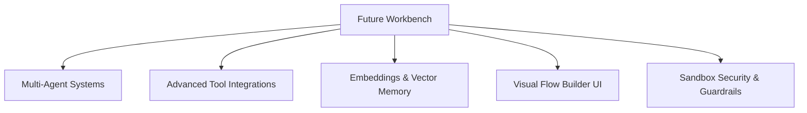

# Future Enhancements & Feature Roadmap

This document outlines proposed architecture enhancements, premium features, and future development vectors to evolve the **AI Agent Builder Platform** into a production-grade orchestration engine.

---

## 🗺️ Roadmap Categories

---

## 1. 🤝 Multi-Agent Orchestration (Swarm / Debate)
Enable collaborative multi-agent patterns where agents talk to each other to solve queries.
- **Agent Roles**: Designate specialized agents (e.g., *Researcher Agent* scrapes data and hands summaries to *Coder Agent* to write code, followed by *Reviewer Agent* verifying constraints).
- **Communication Flow**:
  - Implement a **Sequential Chain**: Output of Agent A becomes the input of Agent B.
  - Implement a **Moderated Discussion**: An orchestrator router delegates queries back and forth and returns the consolidated answer.
- **UI Element**: Add a multi-agent workflow layout showing active conversation lines between agents.

---

## ⚡ 2. Advanced Tool Integrations
Expand the tool repository with automated features:
- **OpenAPI / Swagger Auto-Importer**:
  - Allow users to upload a Swagger `.json` or `.yaml` file.
  - Automatically parse endpoints, parameter requirements, and headers to generate custom REST tools visually.
- **Safe SQL Database Explorer**:
  - A visual database tool that accepts connection strings, safely queries schemas, and returns tables to the agent.
- **REST Auth Vault**:
  - Implement OAuth2 token renewal interfaces or encrypted credential storage vaults (using secrets packages) for REST API tools.

---

## 📂 3. Document Chunking & Vector Databases
Upgrade the keyword search memory retrieval into a true semantic vector retrieval architecture.
- **Document Extractors**: Add libraries (like `pypdf`, `python-docx`) to support uploading real PDF/Doc files directly.
- **Embeddings Pipeline**: Inject a local HuggingFace sentence-transformers client or use LLM embedding endpoints (OpenAI / Gemini embeddings) to generate vectors.
- **SQLite Vector Extension / ChromaDB**: Store embeddings in a local vector database for fast similarity retrieval.

---

## 🎨 4. Visual Node-Graph Builder
Upgrade the form-based configuration card to an interactive drag-and-drop workflow canvas:
- **Node Blocks**: Visual blocks for *Agents*, *Built-in Tools*, *Custom HTTP APIs*, *Variables*, and *Output Formatter*.
- **Visual Links**: Draw lines to direct variables from a tool's observation into the next reasoning prompt block.
- **Execution Highlights**: Light up individual nodes on the canvas in real-time as execution flows through the backend.

---

## 🔒 5. Enterprise Sandbox Security & Guardrails
Augment the custom script executor's safety controls:
- **WASM / Docker Sandbox**: Instead of running scripts within `exec` check libraries on the main thread, spawn scripts inside isolated Docker containers or WebAssembly runtimes with CPU/Memory limits.
- **Output Guardrails**: Add semantic checks to sanitize outputs before rendering them to block prompt injections or output leakage.
