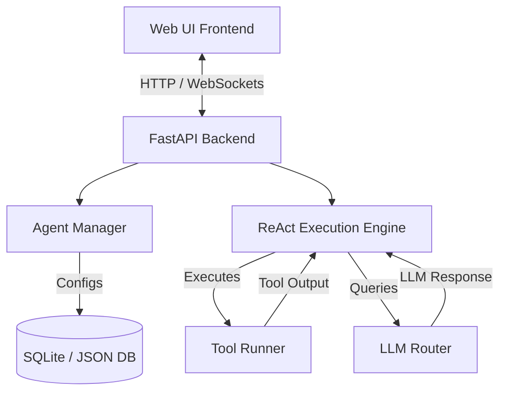

# AI Agent Builder Platform Implementation Plan

This project implements a complete **AI Agent Builder Platform** where users can create, configure, and run custom intelligent agents. The application will consist of a **Python FastAPI backend** executing a ReAct (Reasoning and Action) loop, and a **modern, high-fidelity HTML/CSS/JS frontend** for visual configuration and interactive tracing of the agent's thought process.

## Architecture Overview

---

## User Review Required

> [!IMPORTANT]
> **LLM Connectivity & Fallbacks**
> To ensure the application is immediately usable without requiring the user to supply active API keys (e.g., OpenAI/Gemini), we will build a dual-mode LLM engine:
> 1. **Mock Mode (Default/Fallback)**: Simulates realistic ReAct steps (Thought -> Action -> Observation -> Final Answer) for key demo scenarios (e.g., math calculations, web searches, formatting). This guarantees the project runs straight out of the box.
> 2. **Live Mode**: Allows the user to input their own Gemini, OpenAI, or Anthropic API keys directly via the UI/environment variables to execute real ReAct loops.

---

## Open Questions

> [!NOTE]
> 1. Do you have a preferred LLM API key you want configured by default, or is the UI-input approach with mock fallback acceptable?
> 2. Are there specific pre-built tools you would like included beyond:
>    - **Math Calculator** (evaluates math expressions safely)
>    - **Web Scraper / Fetcher** (fetches page text content)
>    - **Weather Service Mock** (retrieves weather data)
>    - **General Web Search Mock** (searches query terms)
>    - **HTTP API Request Tool** (allows configuring external GET/POST requests)

---

## Proposed Changes

### Backend Component (Python)
We will implement the backend in Python using `FastAPI` for speed and simplicity. It will manage agents, tools, memory, and handle live agent runs.

#### [NEW] [backend/main.py](file:///c:/Users/Rachi/AI-Agent-Builder-Platform/backend/main.py)
* Entrypoint for the FastAPI server.
* Provides REST endpoints for:
  - Managing agents (Create, Read, Update, Delete).
  - Executing tools manually for testing.
  - Initializing and running an agent loop (supporting real-time streaming of ReAct thoughts/actions via WebSockets or SSE).
  - Fetching runs/history logs.

#### [NEW] [backend/react_engine.py](file:///c:/Users/Rachi/AI-Agent-Builder-Platform/backend/react_engine.py)
* Core ReAct reasoning loop implementation.
* Structured prompt formatting using System Instructions, Memory, and Available Tools list.
* Logic to parse the agent's output:
  - Format: `Thought: ...` followed by `Action: tool_name` and `Action Input: input_val` or `Final Answer: ...`.
  - Safety check to prevent infinite loops (max iteration limit).
  - Integrates short-term conversation memory and runs custom tools.

#### [NEW] [backend/tools.py](file:///c:/Users/Rachi/AI-Agent-Builder-Platform/backend/tools.py)
* Base tool interface class.
* Pre-packaged tools:
  - `CalculatorTool`: Evaluates mathematical expressions using a sandboxed/safe evaluator.
  - `WebFetchTool`: Extracts text content from a specified URL.
  - `SerpSearchTool`: Mocked Google Search style retriever.
  - `RestApiTool`: Standard HTTP execution tool allowing custom GET/POST calls.

#### [NEW] [backend/models.py](file:///c:/Users/Rachi/AI-Agent-Builder-Platform/backend/models.py)
* Pydantic schemas for Agent configurations, tool schemas, and execution logs.
* Database/JSON models to persist data.

---

### Frontend Component (Web UI Dashboard)
A gorgeous, modern visual environment featuring a dark theme, glassmorphic layout, glowing status logs, and step-by-step ReAct loop rendering.

#### [NEW] [frontend/index.html](file:///c:/Users/Rachi/AI-Agent-Builder-Platform/frontend/index.html)
* Core UI structure.
* Panels:
  - **Sidebar**: Manage and select configured agents (includes templates like "Research Assistant", "Math Genius", etc.).
  - **Agent Configuration Panel**: Forms to change Name, Description, LLM Provider, Temperature, System Prompts, memory limits, and enable/disable checkboxes for tools.
  - **Chat & Execution Playground**: Left-hand standard chat window, right-hand dynamic **ReAct Terminal Window** highlighting thought paths, active tool execution statuses, and raw inputs/outputs.
  - **Custom Tool Creator**: Setup custom API-driven tools.

#### [NEW] [frontend/index.css](file:///c:/Users/Rachi/AI-Agent-Builder-Platform/frontend/index.css)
* Custom dark/glowing design system (slate backgrounds, neon borders, smooth scale/hover effects).
* Styled terminal block with custom code highlights for ReAct steps.

#### [NEW] [frontend/app.js](file:///c:/Users/Rachi/AI-Agent-Builder-Platform/frontend/app.js)
* Frontend logic: REST calls to backend API.
* Dynamic DOM updates for agent creation, configuration edits, and real-time execution animation of the ReAct steps.

---

## Verification Plan

### Automated Verification
- We will write a lightweight pytest script in Python (`tests/test_react_engine.py`) to verify:
  - Parsing logic for `Thought:`, `Action:`, `Action Input:`, and `Final Answer:`.
  - Tool execution boundaries.
  - Handling of max-iteration safety limits.

### Manual Verification
- We will start the FastAPI backend server and open the browser.
- Create a new agent named "Researcher", enable the "Web Fetcher" and "Calculator" tools, set a custom instruction, and run queries.
- Inspect the visual execution steps in the UI terminal to ensure the ReAct trace is clear and clean.
